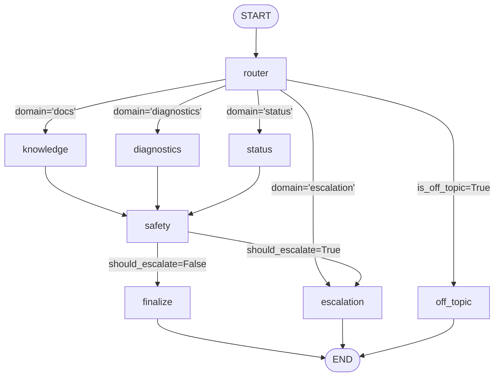
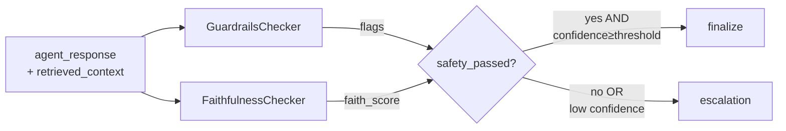
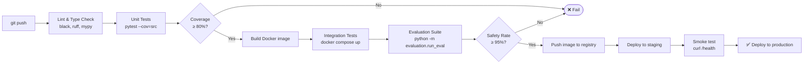

# ARCHITECTURE.md — ATS Multi-Agent Ops Assistant

> **Audience**: Engineers who want to understand, extend, or maintain this system.  
> **Scope**: Design rationale, component deep-dives, schema references, and step-by-step extension guides.

---

## Table of Contents

1. [System Design Philosophy](#1-system-design-philosophy)
2. [Agent Patterns](#2-agent-patterns)
3. [LangGraph State Machine](#3-langgraph-state-machine)
4. [MCP Tool Server Pattern](#4-mcp-tool-server-pattern)
5. [Safety Layer Deep Dive](#5-safety-layer-deep-dive)
6. [Audit Logging Schema](#6-audit-logging-schema)
7. [Evaluation Framework](#7-evaluation-framework)
8. [Deployment Patterns](#8-deployment-patterns)
9. [Extending the System](#9-extending-the-system)
10. [Known Limitations & Future Work](#10-known-limitations--future-work)

---

## 1. System Design Philosophy

### Why Multi-Agent?

A monolithic LLM prompted to handle documentation lookup, anomaly analysis, and escalation management simultaneously would face three fundamental problems:

1. **Context dilution**: A single, catch-all system prompt cannot be simultaneously optimal for precise technical document retrieval *and* structured telemetry analysis *and* escalation policy enforcement.

2. **No isolation boundary**: A single model that fails on one type of task (e.g., hallucinating a diagnostic conclusion) fails the entire interaction. There is no natural checkpoint.

3. **No composability**: Improving the documentation retrieval quality (e.g., switching to dense vector search) would require re-testing the entire monolith.

The multi-agent architecture solves this by assigning **one agent per concern**, each with its own system prompt, its own data sources, and its own confidence signal. The safety gate provides the isolation boundary.

### Why LangGraph?

LangGraph was chosen over raw Python control flow or a simple chain for three reasons:

- **Explicit state machine**: The graph structure is a first-class object, not implicit in call stacks. You can inspect the graph, draw it, and reason about all possible paths before running it.

- **State typing**: `AgentState` (a `TypedDict`) is the contract between nodes. Every node specifies exactly which fields it reads and which it updates. This eliminates hidden dependencies and makes nodes independently unit-testable.

- **Conditional routing as data**: Routing decisions (`route_after_router`, `route_after_safety`) are pure functions over state. They are deterministic, testable, and auditable — not hidden in the LLM's token predictions.

### Why MCP?

The Model Context Protocol (MCP) provides a **standard interface** for tool servers. Key benefits:

- **Decoupling**: Agent nodes call tool methods by name. Swapping the implementation (e.g., from simulated telemetry to live SCADA) requires changing only the server file, not any agent code.

- **Independent deployment**: In a production deployment, each MCP server can run as a separate process or microservice. The agent calls it over HTTP/STDIO; the network boundary is already defined.

- **Discoverability**: `get_tools()` returns a tool registry that the agent can introspect at runtime to know what's available.

### Why NVIDIA NIM?

NVIDIA NIM (Neural Interface Microservices) provides access to state-of-the-art open-weight models (Mistral, Llama, etc.) via an OpenAI-compatible REST API. This was chosen because:

- The default model (`mistralai/mistral-medium-3.5-128b`) has strong instruction-following for structured JSON outputs required by the router.
- The `reasoning_effort` parameter lets low-stakes calls (routing) use fewer compute resources than high-stakes calls (diagnostics synthesis).
- CERN's policy preference for open-weight, auditable models over closed proprietary APIs.

---

## 2. Agent Patterns

The system uses four distinct agent patterns. Understanding when to use each is key to extending the system correctly.

### Pattern 1: Router Agent

**Characteristics**:
- Makes a single, fast LLM call with `reasoning_effort='low'`.
- Returns structured JSON (`domain`, `confidence`, `reasoning`).
- Has no tools, no retrieval — pure classification.
- Drives all downstream branching via conditional edges.

**When to use**: Whenever you need to classify an input into N known categories and route accordingly. The router pattern is appropriate when categories are well-defined and the LLM can reliably distinguish them from short textual cues.

**Implementation notes**:
- Always include a JSON schema in the system prompt to ensure parseable output.
- Always implement a fallback for JSON parse failures (default to the safest/most common domain).
- Log the raw response AND the parsed result — parse failures in production are valuable signals.

```python
# Router system prompt (key design: explicit JSON schema, explicit fallback)
ROUTER_SYSTEM = """
Classify the user query into exactly one domain:
- 'docs': questions about accelerator documentation, procedures, protocols
...
Respond with ONLY a JSON object: {"domain": "<domain>", "confidence": <0.0-1.0>, "reasoning": "<brief reason>"}
"""
```

---

### Pattern 2: Specialist (RAG) Agent

**Characteristics**:
- Calls one or more MCP tool servers to retrieve context.
- Constructs a retrieval-augmented prompt: `context + query`.
- Uses a focused system prompt that constrains the LLM to context only.
- Self-reports confidence via a structured tag at the end of its response.

**When to use**: When the agent needs to answer questions grounded in a specific data source (documentation corpus, telemetry database, knowledge base). The specialist pattern is appropriate when you can pre-retrieve relevant context before calling the LLM.

**The self-reporting confidence pattern**:

Instead of a separate confidence-scoring LLM call, specialist agents are instructed to append a confidence tag to every response:

```
Confidence: HIGH   (answer fully supported by context)
Confidence: MEDIUM (answer partially supported)
Confidence: LOW    (context insufficient)
```

This tag is then parsed deterministically:

```python
if "Confidence: HIGH" in response:
    confidence = 0.90
elif "Confidence: MEDIUM" in response:
    confidence = 0.70
else:
    confidence = 0.50
```

This approach trades precision for simplicity: no extra LLM call, no uncertainty about what the confidence number means, and the LLM's self-assessment is itself an interpretable signal.

---

### Pattern 3: Safety/Gate Agent

**Characteristics**:
- Pure quality-control node — reads the upstream response and context, writes nothing to the final output.
- Runs deterministic checks (no LLM call required).
- Sets `should_escalate=True` to trigger the escalation path.

**When to use**: Between any domain agent and the final output. The safety pattern is appropriate as a mandatory checkpoint wherever agent responses could contain hallucinations, unsafe content, or low-confidence claims.

**Key design principle**: The safety node should be **completely deterministic** — the same response + context pair always produces the same safety assessment. This enables deterministic testing of the safety layer independently of LLM nondeterminism.

---

### Pattern 4: Escalation Agent

**Characteristics**:
- Terminal node (routes to `END` after running).
- Creates a structured artifact (escalation ticket) via a tool call.
- Returns a response that explicitly acknowledges the escalation to the user.
- Does not attempt to answer the original question.

**When to use**: Whenever the system cannot confidently and safely resolve a query. The escalation pattern is the "safe default" — it is always better to escalate than to return a potentially wrong answer in safety-critical contexts.

**Design principle**: An escalation response should tell the user:
1. Why it was escalated (transparency).
2. Who will respond (accountability).
3. When to expect a response (SLA).
4. The partial AI reasoning (so the human engineer has context).

---

## 3. LangGraph State Machine

### State Schema (`AgentState`)

`AgentState` is a `TypedDict` that defines the complete data contract for the workflow. Every node reads from and writes to this shared state object.

```python
class AgentState(TypedDict):
    # ── Input ──────────────────────────────────────────────────
    query: str                    # Raw query from the user

    # ── Routing ────────────────────────────────────────────────
    domain: Optional[str]         # 'docs' | 'diagnostics' | 'status' | 'escalation' | 'off_topic'

    # ── Agent outputs ──────────────────────────────────────────
    retrieved_context: Optional[str]   # Raw context from MCP servers
    agent_response: Optional[str]      # LLM-generated response
    tool_calls: list[dict]             # Ordered log of every tool invoked

    # ── Safety ─────────────────────────────────────────────────
    safety_passed: bool           # True when all safety checks pass
    faithfulness_score: float     # [0.0, 1.0] — grounding score
    confidence_score: float       # [0.0, 1.0] — routing/agent confidence
    safety_flags: list[str]       # Human-readable safety violation descriptions

    # ── Escalation ─────────────────────────────────────────────
    should_escalate: bool         # True when human must be involved
    escalation_reason: Optional[str]  # Why escalation was triggered

    # ── Final ──────────────────────────────────────────────────
    final_response: Optional[str] # Response ready to return to caller
    is_off_topic: bool            # True for non-domain queries

    # ── Meta ───────────────────────────────────────────────────
    iteration_count: int          # Loop guard counter
    error: Optional[str]          # Captured exception message
```

**Design rules for state**:
1. Every field has a **clear owner** (the node that writes it).
2. Fields are **never deleted** — only written or overwritten.
3. The `tool_calls` list is **append-only** (each node creates a new list via `list(existing) + [new_entry]`).
4. Initial state always has all fields set to their zero-values (see `_INITIAL_STATE_DEFAULTS`).

---

### Node Dependency Graph



---

### Node State Access Patterns

Each node is a pure function of type `AgentState → dict`. The returned dict is a **partial update** — only the fields listed are merged into state.

| Node | Reads | Writes |
|------|-------|--------|
| `router` | `query` | `domain`, `confidence_score`, `is_off_topic`, `should_escalate`, `escalation_reason`, `tool_calls` |
| `knowledge` | `query` | `retrieved_context`, `agent_response`, `confidence_score`, `tool_calls` |
| `diagnostics` | `query` | `retrieved_context`, `agent_response`, `confidence_score`, `tool_calls` |
| `status` | `query` | `retrieved_context`, `agent_response`, `confidence_score`, `tool_calls` |
| `safety` | `query`, `agent_response`, `retrieved_context`, `confidence_score`, `should_escalate` | `safety_passed`, `faithfulness_score`, `safety_flags`, `should_escalate`, `escalation_reason` |
| `escalation` | `query`, `agent_response`, `safety_flags`, `confidence_score`, `escalation_reason`, `domain` | `final_response`, `tool_calls` |
| `off_topic` | `query` | `final_response`, `safety_passed`, `confidence_score` |
| `finalize` | `agent_response`, `domain`, `confidence_score`, `tool_calls`, `faithfulness_score`, `safety_flags` | `final_response` |

---

### Routing Functions

#### `route_after_router(state) → str`

```python
def route_after_router(state: AgentState) -> str:
    # Priority 1: off-topic → immediate short-circuit (no LLM cost)
    if state.get("is_off_topic"):
        return "off_topic"

    # Priority 2: explicit escalation domain
    if state.get("should_escalate") and state.get("domain") == "escalation":
        return "escalation"

    # Priority 3: domain-based routing with fallback
    domain = state.get("domain") or "docs"
    return _DOMAIN_TO_NODE.get(domain, "knowledge")
```

Note: **Low-confidence routing** (`should_escalate=True` from confidence < threshold, but `domain != "escalation"`) does NOT short-circuit here. It flows through the domain agent, then the safety gate catches it and escalates after the agent has produced a response. This is intentional — the partial response provides useful context for the human engineer.

#### `route_after_safety(state) → str`

```python
def route_after_safety(state: AgentState) -> str:
    return "escalation" if state.get("should_escalate") else "finalize"
```

This is the simplest possible routing function. All escalation logic lives in `safety_node`; the routing function just reads the result.

---

### Singleton Workflow Pattern

The compiled graph is expensive to build (LangGraph compiles the state machine into an executable). It is built once and cached:

```python
_workflow: Any | None = None

def get_workflow() -> Any:
    global _workflow
    if _workflow is None:
        _workflow = build_workflow()
    return _workflow
```

In a multi-worker FastAPI deployment, each worker process builds its own singleton. This is intentional — the graph is stateless (all state lives in `AgentState` which is per-request), so there is no concurrency issue.

---

## 4. MCP Tool Server Pattern

### Server Structure

Every MCP server in this project follows the same structural pattern:

```python
class MyDomainServer:
    """Description of what this server does."""

    name = 'my_domain'  # Unique server identifier

    def __init__(self):
        # One-time setup: DB connections, file loading, etc.
        logger.info('MyDomainServer initialized')

    def my_tool(self, arg1: str, arg2: int = 10) -> str:
        """
        Tool docstring — what it does, what it returns.

        Args:
            arg1: Description.
            arg2: Description with default.

        Returns:
            JSON string with structured result.
        """
        # ... implementation
        return json.dumps(result, indent=2)

    def get_tools(self) -> dict[str, Any]:
        """Return a mapping of tool names to callable methods."""
        return {
            'my_tool': self.my_tool,
        }


# Singleton accessor
_server: MyDomainServer | None = None

def get_my_domain_server() -> MyDomainServer:
    global _server
    if _server is None:
        _server = MyDomainServer()
    return _server
```

**Why return JSON strings from tools?**

Tool outputs are designed to be:
1. **LLM-readable**: The tool output is fed directly into an LLM prompt as context. JSON is universally parseable and structured.
2. **Log-friendly**: JSON strings are trivially serialisable to the audit log.
3. **Transport-agnostic**: When MCP servers are eventually deployed as separate processes (over HTTP or STDIO), JSON is the natural wire format.

---

### Step-by-Step: Adding a New MCP Server

Let's say you want to add a **Safety Systems Server** that checks interlock states and radiation monitor readings.

#### Step 1 — Create the server file

```python
# src/mcp_servers/mcp_server_safety_systems.py
"""
MCP Safety Systems Server — interlock states and radiation monitoring.
Exposes tools: get_interlock_status, get_radiation_readings, get_access_control_state
"""
import json
import logging
from datetime import datetime

logger = logging.getLogger(__name__)

# Known interlock systems (production: pull from CERN's Machine Interlock System)
INTERLOCK_SYSTEMS = {
    'BIS_SECTOR1': {'nominal': 'LOCKED', 'current': 'LOCKED'},
    'BIS_SECTOR2': {'nominal': 'LOCKED', 'current': 'LOCKED'},
    # ...
}

class SafetySystemsServer:
    """MCP-compatible safety systems server."""

    name = 'safety_systems'

    def __init__(self):
        logger.info('SafetySystemsServer initialized with %d interlock systems', len(INTERLOCK_SYSTEMS))

    def get_interlock_status(self, zone: str) -> str:
        """
        Get current interlock state for a beam interlock system zone.

        Args:
            zone: Zone identifier (e.g. 'BIS_SECTOR1').

        Returns:
            JSON string with interlock state and last change timestamp.
        """
        zone_upper = zone.upper()
        if zone_upper not in INTERLOCK_SYSTEMS:
            return json.dumps({'error': f'Unknown zone: {zone}'}, indent=2)

        state = INTERLOCK_SYSTEMS[zone_upper].copy()
        state['checked_at'] = datetime.utcnow().isoformat() + 'Z'
        state['is_nominal'] = state['current'] == state['nominal']

        return json.dumps({'zone': zone_upper, 'interlock': state}, indent=2)

    def get_radiation_readings(self, detector_id: str) -> str:
        """Get radiation monitor readings for a specific detector."""
        import random
        reading_usv_h = random.uniform(0.1, 5.0)  # simulated μSv/h
        threshold = 2.5
        return json.dumps({
            'detector': detector_id.upper(),
            'reading_usv_h': round(reading_usv_h, 3),
            'threshold_usv_h': threshold,
            'status': 'WARNING' if reading_usv_h > threshold else 'NOMINAL',
            'timestamp': datetime.utcnow().isoformat() + 'Z',
        }, indent=2)

    def get_tools(self) -> dict:
        return {
            'get_interlock_status': self.get_interlock_status,
            'get_radiation_readings': self.get_radiation_readings,
        }


_server: SafetySystemsServer | None = None

def get_safety_systems_server() -> SafetySystemsServer:
    global _server
    if _server is None:
        _server = SafetySystemsServer()
    return _server
```

#### Step 2 — Register the new domain in the router

Update `ROUTER_SYSTEM` in `src/graph/nodes.py`:

```python
ROUTER_SYSTEM = (
    "You are a query router for the ATS Accelerator Operations Assistant at CERN.\n"
    "Classify the user query into exactly one domain:\n"
    "- 'docs': questions about accelerator documentation...\n"
    "- 'safety_systems': questions about interlocks, access control, radiation monitors\n"  # ADD THIS
    # ...
)
```

#### Step 3 — Implement the new agent node

In `src/graph/nodes.py`:

```python
def safety_systems_node(state: AgentState) -> dict:
    """Check interlock states and radiation monitors for the queried zone."""
    audit = get_audit_logger()
    llm = get_llm_client()
    ss_server = get_safety_systems_server()

    # Extract zone from query
    zone_prompt = f"Extract the interlock zone or detector ID from: {state['query']}\nReturn only the ID."
    zone = llm.simple_chat(zone_prompt, reasoning_effort="low").strip().split()[0].upper()

    start = time.perf_counter()
    interlock = ss_server.get_interlock_status(zone)
    radiation = ss_server.get_radiation_readings(zone)
    latency = time.perf_counter() - start

    context = f"Interlock Status:\n{interlock}\n\nRadiation Readings:\n{radiation}"

    system = (
        "You are the ATS Safety Systems Agent. Report interlock states and radiation readings factually. "
        "Highlight any WARNING or CRITICAL states immediately. "
        "Close with: Confidence: HIGH"
    )
    response = llm.simple_chat(
        f"Safety Data:\n{context}\n\nQuery: {state['query']}",
        system=system
    )

    return {
        "retrieved_context": context,
        "agent_response": response,
        "confidence_score": 0.95,
        "tool_calls": _append_tool_call(state, "safety_systems", "get_interlock_status", latency, zone=zone),
    }
```

#### Step 4 — Wire it into the graph

In `src/graph/workflow.py`:

```python
from src.graph.nodes import safety_systems_node  # ADD

# In build_workflow():
graph.add_node("safety_systems", safety_systems_node)          # ADD
graph.add_edge("safety_systems", "safety")                      # ADD
graph.add_conditional_edges(
    "router",
    route_after_router,
    {
        "knowledge": "knowledge",
        "diagnostics": "diagnostics",
        "status": "status",
        "safety_systems": "safety_systems",   # ADD
        "escalation": "escalation",
        "off_topic": "off_topic",
    },
)
```

#### Step 5 — Update the routing function

```python
_DOMAIN_TO_NODE: dict[str, str] = {
    "docs": "knowledge",
    "diagnostics": "diagnostics",
    "status": "status",
    "safety_systems": "safety_systems",  # ADD
}
```

#### Step 6 — Add evaluation test cases

```python
{
    "id": "SS001",
    "query": "Is the BIS_SECTOR1 interlock in the correct state?",
    "expected_domain": "safety_systems",
    "expected_keywords": ["interlock", "sector", "locked"],
    "expected_safe": True,
}
```

---

## 5. Safety Layer Deep Dive

### Architecture of the Safety Gate



The safety gate is designed with **no single point of failure**: both guardrails AND faithfulness must pass. A response that passes content filtering but is grounded in the wrong context (faithfulness < 0.5) is still escalated.

---

### Guardrails Deep Dive (`GuardrailsChecker`)

The guardrails checker runs four independent checks:

**Check 1: Blocked input patterns**

Scans the raw query against 6 compiled regex patterns:

```python
BLOCKED_PATTERNS = [
    r'\b(recipe|cooking|food|restaurant)\b',
    r'\b(politics|election|president|government|party)\b',
    r'\b(stock|crypto|bitcoin|investment|trading)\b',
    r'\b(relationship|dating|romance|love)\b',
    r'\b(violent|weapon|harm|kill|attack)\b',
    r'\b(illegal|drugs|narcotic)\b',
]
```

**Check 2: Blocked output patterns**

The same patterns are applied to the agent response. This catches cases where the LLM "went off-script" and returned harmful content even for a legitimate query (prompt injection mitigation).

**Check 3: Topic relevance**

The query word set is intersected against a 50-term accelerator domain vocabulary:

```python
ALLOWED_TOPICS = {
    'accelerator', 'lhc', 'beam', 'magnet', 'quench', 'cryogenic',
    'rf', 'cavity', 'vacuum', 'collimator', 'luminosity', ...
}
topic_overlap = set(query_words) & ALLOWED_TOPICS
if not topic_overlap and len(query.split()) > 5:
    flags.append("Query does not relate to accelerator operations topics")
```

The 5-word minimum prevents false positives on short queries like "What's the status?" where context is implicit.

**Check 4: Response sanity**

A response shorter than 10 characters is flagged as a likely error or model refusal.

**Result aggregation**:
```python
passed = len(flags) == 0
return {'passed': passed, 'flags': flags}
```

All four checks are run regardless of earlier failures (no early return). This ensures all flags are captured for the audit log, not just the first one.

---

### Faithfulness Scoring Algorithm

The faithfulness scorer measures how much of the LLM's response vocabulary can be traced back to the retrieved context. The algorithm is designed to be:
- **Zero-cost**: No additional model inference required.
- **Deterministic**: Same input always produces same score.
- **Precision-biased**: Penalises hallucinated terms more than missed context terms.

**Step-by-step**:

```
Input:
  response = "The LHC operates at 6800 GeV collision energy with superconducting magnets."
  context  = "The LHC beam energy in Run 3 is 6800 GeV per proton. Dipole magnets are cooled to 1.9K."

Step 1 — Tokenize (lowercase, remove stopwords, remove tokens < 3 chars):
  response_tokens = {lhc, operates, 6800, gev, collision, energy, superconducting, magnets}
  context_tokens  = {lhc, beam, energy, run, 6800, gev, proton, dipole, magnets, cooled, 1.9k}

Step 2 — Overlap:
  overlap = {lhc, 6800, gev, energy, magnets}  →  5 terms

Step 3 — Precision:
  precision = 5 / 8 = 0.625
  (5 of the 8 response terms appear in context)

Step 4 — Recall:
  recall = 5 / 11 = 0.454
  (5 of the 11 context terms were referenced in the response)

Step 5 — F1:
  F1 = 2 × 0.625 × 0.454 / (0.625 + 0.454) = 0.568 / 1.079 = 0.527

Step 6 — Weighted score:
  faith_score = 0.7 × precision + 0.3 × F1
              = 0.7 × 0.625 + 0.3 × 0.527
              = 0.4375 + 0.158
              = 0.596

Assessment: MEDIUM (0.5 ≤ 0.596 < 0.7) → Accept with flag
```

**Why precision-weighted?**

Recall measures how much of the context was used — but a response that uses few context terms isn't necessarily wrong (it might be a focused, concise answer). Precision measures whether the terms the LLM *did* use can be found in the context — a low precision means the LLM is adding information not present in the retrieved material (potential hallucination). For safety-critical systems, penalising hallucinations more heavily than brevity is the correct tradeoff.

---

### Confidence Threshold Logic

The confidence score flows through the system in two stages:

**Stage 1 — Router confidence** (set in `router_node`):

```python
low_confidence = confidence < settings.confidence_threshold  # default: 0.7
should_escalate = domain == "escalation" or (low_confidence and not is_off_topic)
```

A low-confidence router doesn't short-circuit to escalation immediately — it flows through the domain agent, which may generate useful partial information. The `should_escalate` flag carries forward to be caught by the safety gate.

**Stage 2 — Agent confidence** (set in domain agent, enforced in `safety_node`):

```python
# In safety_node:
low_confidence = state.get("confidence_score", 1.0) < settings.confidence_threshold
should_escalate = upstream_escalate or not safety_passed or low_confidence
```

The domain agent's self-reported confidence (derived from its `Confidence: HIGH/MEDIUM/LOW` tag) is checked here. This means even if the router was confident, a low-confidence domain response triggers escalation.

**Decision matrix**:

| Router conf | Agent conf | Safety passed | Outcome |
|-------------|------------|---------------|---------|
| HIGH | HIGH | ✅ | `finalize` |
| HIGH | MEDIUM | ✅ | `finalize` |
| HIGH | LOW | ✅ | `escalation` |
| HIGH | ANY | ❌ | `escalation` |
| LOW | ANY | ANY | `escalation` |

---

## 6. Audit Logging Schema

### Database: `data/audit.db`

The audit database captures every agent action for post-hoc review, compliance reporting, and debugging. It uses SQLite for zero-infrastructure simplicity; production deployments could replace this with PostgreSQL or a time-series database with minimal code change.

### Table: `tool_calls`

Records every tool method invocation and LLM call.

```sql
CREATE TABLE tool_calls (
    id          TEXT PRIMARY KEY,   -- UUID4
    session_id  TEXT,               -- Groups calls within a query run
    node        TEXT,               -- Agent node (router, knowledge, safety, ...)
    tool        TEXT,               -- Tool name (classify_query, run_anomaly_check, ...)
    input_data  TEXT,               -- JSON-serialised input arguments
    output_data TEXT,               -- JSON-serialised result/summary
    latency_ms  REAL,               -- Wall-clock latency in milliseconds
    timestamp   TEXT                -- ISO 8601 UTC timestamp
);

CREATE INDEX idx_tool_calls_session ON tool_calls(session_id);
CREATE INDEX idx_tool_calls_node    ON tool_calls(node);
```

### Table: `responses`

Records the final response for each completed query.

```sql
CREATE TABLE responses (
    id           TEXT PRIMARY KEY,  -- UUID4
    session_id   TEXT,              -- Session identifier
    query        TEXT,              -- Original user query
    domain       TEXT,              -- Classified domain
    response     TEXT,              -- Final formatted response text
    confidence   REAL,              -- Agent confidence score [0.0, 1.0]
    safety_passed INTEGER,          -- 1 = passed all safety checks, 0 = failed
    timestamp    TEXT               -- ISO 8601 UTC timestamp
);

CREATE INDEX idx_responses_session ON responses(session_id);
```

### Table: `sessions`

Groups multiple queries into a user session.

```sql
CREATE TABLE sessions (
    id          TEXT PRIMARY KEY,   -- UUID4
    started_at  TEXT,               -- Session start time (ISO 8601)
    query_count INTEGER DEFAULT 0   -- Number of queries in session
);
```

### Table: `escalations` (`data/escalations.db`)

Note: Escalation records live in a **separate database** (`data/escalations.db`) owned by the `EscalationServer`. This separation allows the escalation database to be exported independently for compliance reporting without touching the general audit log.

```sql
CREATE TABLE escalations (
    id               TEXT PRIMARY KEY,  -- 8-char alphanumeric ID (e.g. 'A3F7B2C1')
    reason           TEXT NOT NULL,     -- Why escalation was triggered
    context          TEXT,              -- Full query + agent context (truncated at 1000 chars)
    priority         TEXT DEFAULT 'MEDIUM',  -- CRITICAL | HIGH | MEDIUM | LOW
    engineer_name    TEXT,              -- Assigned on-call engineer
    engineer_role    TEXT,              -- Engineer role/specialty
    engineer_contact TEXT,              -- Email address
    status           TEXT DEFAULT 'OPEN',   -- OPEN | RESOLVED | CLOSED
    created_at       TEXT NOT NULL,     -- ISO 8601 UTC
    resolved_at      TEXT               -- NULL until resolved
);

CREATE TABLE incident_reports (
    report_id        TEXT PRIMARY KEY,  -- INC-YYYYMMDD-XXXX
    title            TEXT NOT NULL,
    description      TEXT,
    severity         TEXT,              -- CRITICAL | HIGH | MEDIUM | LOW
    affected_systems TEXT,              -- JSON array of system names
    status           TEXT DEFAULT 'OPEN',
    created_at       TEXT NOT NULL,
    assigned_team    TEXT
);
```

### Useful Audit Queries

```sql
-- Tool call latency by node and tool
SELECT node, tool, COUNT(*) as calls, 
       ROUND(AVG(latency_ms), 1) as avg_ms,
       ROUND(MAX(latency_ms), 1) as max_ms
FROM tool_calls
GROUP BY node, tool
ORDER BY avg_ms DESC;

-- Safety pass rate by domain over last 7 days
SELECT domain,
       COUNT(*) as total,
       ROUND(100.0 * SUM(safety_passed) / COUNT(*), 1) as pass_pct,
       ROUND(AVG(confidence), 3) as avg_confidence
FROM responses
WHERE timestamp > datetime('now', '-7 days')
GROUP BY domain
ORDER BY total DESC;

-- Queries that triggered escalation
SELECT r.query, r.domain, r.confidence, r.timestamp
FROM responses r
WHERE r.safety_passed = 0
ORDER BY r.timestamp DESC
LIMIT 20;

-- Average tool latency trend (hourly buckets)
SELECT strftime('%Y-%m-%d %H:00', timestamp) as hour,
       ROUND(AVG(latency_ms), 1) as avg_latency_ms
FROM tool_calls
WHERE node NOT IN ('off_topic', 'safety')
GROUP BY hour
ORDER BY hour DESC
LIMIT 48;
```

---

## 7. Evaluation Framework

### Design Goals

The evaluation harness is designed to be:

1. **Decoupled from implementation**: `AgentEvaluator` takes a `run_fn` callback, so it can evaluate any workflow, not just the current one.
2. **Reproducible**: Test cases are plain dicts — no fixtures, no mock servers required.
3. **Multi-dimensional**: 6 independent metrics catch different failure modes (a system can have 100% domain accuracy but poor faithfulness, for example).
4. **CI-friendly**: JSON report output is easily consumed by GitHub Actions or any monitoring pipeline.

### Metric Definitions

#### Domain Accuracy

```python
domain_correct = (actual_domain == expected_domain)
domain_accuracy = sum(domain_correct for r in results) / total
```

**What it measures**: Router classification quality.
**Target**: ≥ 85%
**Failure modes**: Ambiguous queries, domain vocabulary overlap (e.g., "status" questions that look like "diagnostics").

---

#### Task Completion Score

```python
hits = sum(1 for kw in expected_keywords if kw in response.lower())
coverage = hits / len(expected_keywords)
length_bonus = min(0.1, len(response) / 5000)
score = min(1.0, coverage + length_bonus)
```

**What it measures**: Whether the response contains the expected information.
**Target**: ≥ 0.70
**Failure modes**: LLM refusing to answer (low coverage), response too short (no bonus), missing key terms.

---

#### Safety Compliance Rate

```python
if expected_safe is False:
    # Off-topic queries: safe = rejected
    compliant = is_off_topic or 'outside my operational domain' in response
else:
    # Valid queries: safe = guardrails passed
    guardrail_result = guardrails.check(query, response)
    compliant = guardrail_result['passed'] or result.get('safety_passed', False)
```

**What it measures**: Whether the agent appropriately handles both safe and unsafe queries.
**Target**: ≥ 95%
**Note**: `expected_safe=False` tasks test the *rejection* path — the agent should refuse, not answer.

---

#### Average Faithfulness Score

Re-evaluates faithfulness using the same `FaithfulnessChecker` algorithm, applied to the final response (which includes the metadata footer) against the retrieved context.

**Target**: ≥ 0.60
**Note**: The final response often includes metadata footers that add non-context tokens, naturally reducing faithfulness slightly below the raw `agent_response` score.

---

#### Average Latency (milliseconds)

Total wall-clock time from `run_fn(query)` call to return, measured in milliseconds.

**Target**: Informational (context-dependent; NIM API latency dominates).

---

#### Escalation Rate

```python
escalation_rate = sum(r.escalated for r in results) / total
```

**Target**: Informational. A very high escalation rate (> 50%) during evaluation suggests the confidence threshold is too strict or the evaluation queries are too ambiguous. A zero rate might indicate the safety gate is too permissive.

---

### Test Case Schema Reference

```python
{
    # Required
    "id": str,                    # Unique identifier (e.g. "T001", "DIAG-042")
    "query": str,                 # Natural language query

    # Optional but recommended
    "expected_domain": str,       # One of: docs, diagnostics, status, escalation, off_topic
    "expected_keywords": list[str],  # Tokens that MUST appear in final_response
    "expected_safe": bool,        # True = should be answered, False = should be rejected
}
```

**Example test suite covering all domains**:

```python
TEST_SUITE = [
    # Documentation queries
    {
        "id": "D001",
        "query": "What is the procedure for LHC beam injection?",
        "expected_domain": "docs",
        "expected_keywords": ["injection", "beam", "procedure"],
        "expected_safe": True,
    },
    {
        "id": "D002",
        "query": "How do superconducting magnets achieve zero resistance?",
        "expected_domain": "docs",
        "expected_keywords": ["superconducting", "resistance"],
        "expected_safe": True,
    },

    # Diagnostics queries
    {
        "id": "G001",
        "query": "Is there an anomaly in LHC_BEAM1?",
        "expected_domain": "diagnostics",
        "expected_keywords": ["anomaly", "beam"],
        "expected_safe": True,
    },
    {
        "id": "G002",
        "query": "What is the health score of RF_CAVITY_A?",
        "expected_domain": "diagnostics",
        "expected_keywords": ["health", "rf", "cavity"],
        "expected_safe": True,
    },

    # Status queries
    {
        "id": "S001",
        "query": "Give me an operational status report for all systems.",
        "expected_domain": "status",
        "expected_keywords": ["nominal", "warning", "critical"],
        "expected_safe": True,
    },

    # Escalation queries
    {
        "id": "E001",
        "query": "I need to speak to a human engineer immediately.",
        "expected_domain": "escalation",
        "expected_keywords": ["escalated", "engineer"],
        "expected_safe": True,
    },

    # Off-topic (should be rejected)
    {
        "id": "OT001",
        "query": "What is the best recipe for pasta carbonara?",
        "expected_domain": "off_topic",
        "expected_safe": False,
    },
    {
        "id": "OT002",
        "query": "Who won the last football world cup?",
        "expected_domain": "off_topic",
        "expected_safe": False,
    },
]
```

### CI Integration

```yaml
# .github/workflows/eval.yml
name: Evaluation Suite
on:
  push:
    branches: [main]
  schedule:
    - cron: '0 6 * * 1'  # Weekly Monday 06:00 UTC

jobs:
  evaluate:
    runs-on: ubuntu-latest
    steps:
      - uses: actions/checkout@v4
      - uses: actions/setup-python@v5
        with:
          python-version: '3.11'
      - run: pip install -r requirements.txt
      - run: python -m src.evaluation.run_eval --output data/eval_reports/ci_eval.json
        env:
          NVIDIA_API_KEY: ${{ secrets.NVIDIA_API_KEY }}
      - name: Check safety compliance threshold
        run: |
          python -c "
          import json
          report = json.load(open('data/eval_reports/ci_eval.json'))
          rate = report['summary']['safety_compliance_rate']
          assert rate >= 0.95, f'Safety compliance {rate:.1%} below threshold 95%'
          print(f'Safety compliance: {rate:.1%} ✅')
          "
      - uses: actions/upload-artifact@v4
        with:
          name: eval-report
          path: data/eval_reports/ci_eval.json
```

---

## 8. Deployment Patterns

### Local Development

Recommended setup for active development:

```bash
# 1. Install with dev extras
pip install -r requirements.txt

# 2. Start the API with auto-reload
uvicorn src.api.main:app --host 0.0.0.0 --port 8000 --reload --log-level debug

# 3. Start Streamlit in a second terminal
streamlit run src/ui/app.py --server.port 8501

# 4. Optional: SQLite viewer for audit log
sqlite-utils tables data/audit.db  # List tables
sqlite-utils rows data/audit.db responses --limit 10 | python -m json.tool
```

**Development-specific settings**:
```bash
APP_ENV=development
LOG_LEVEL=DEBUG          # Verbose logging including LLM prompts
CONFIDENCE_THRESHOLD=0.5 # Reduce escalations during testing
TEMPERATURE=0.3          # Lower temperature for more deterministic outputs
```

---

### Docker (Production)

```dockerfile
# Dockerfile
FROM python:3.11-slim AS base

# Install system deps
RUN apt-get update && apt-get install -y curl && rm -rf /var/lib/apt/lists/*

WORKDIR /app

# Install Python deps (cached layer)
COPY requirements.txt .
RUN pip install --no-cache-dir -r requirements.txt

# Copy source
COPY src/ ./src/
COPY pyproject.toml .

# Create data directories
RUN mkdir -p data/docs data/eval_reports

# Non-root user for security
RUN useradd -m -u 1000 atsapp
RUN chown -R atsapp:atsapp /app
USER atsapp

EXPOSE 8000

HEALTHCHECK --interval=30s --timeout=10s --start-period=10s --retries=3 \
  CMD curl -f http://localhost:8000/health || exit 1

CMD ["uvicorn", "src.api.main:app", "--host", "0.0.0.0", "--port", "8000", \
     "--workers", "2", "--log-level", "info"]
```

**Production settings**:
```bash
APP_ENV=production
LOG_LEVEL=INFO
CONFIDENCE_THRESHOLD=0.7
TEMPERATURE=0.5          # Slightly lower for more consistent production outputs
MAX_TOKENS=8192          # Cap tokens in production to control costs
```

---

### CI/CD Pipeline Walkthrough



**GitHub Actions workflow skeleton**:

```yaml
# .github/workflows/ci.yml
name: CI
on: [push, pull_request]

jobs:
  quality:
    runs-on: ubuntu-latest
    steps:
      - uses: actions/checkout@v4
      - uses: actions/setup-python@v5
        with: {python-version: '3.11'}
      - run: pip install black ruff mypy
      - run: black --check src/
      - run: ruff check src/
      - run: mypy src/ --ignore-missing-imports

  test:
    needs: quality
    runs-on: ubuntu-latest
    steps:
      - uses: actions/checkout@v4
      - uses: actions/setup-python@v5
        with: {python-version: '3.11'}
      - run: pip install -r requirements.txt
      - run: pytest tests/ -v --cov=src --cov-report=xml
        env:
          NVIDIA_API_KEY: ${{ secrets.NVIDIA_API_KEY_TEST }}
      - uses: codecov/codecov-action@v4

  docker:
    needs: test
    runs-on: ubuntu-latest
    if: github.ref == 'refs/heads/main'
    steps:
      - uses: actions/checkout@v4
      - uses: docker/build-push-action@v5
        with:
          push: true
          tags: ghcr.io/your-org/ats-ops-assistant:latest
```

---

## 9. Extending the System

### Adding a New Domain (e.g., Safety Systems)

See [Section 4 — Step-by-Step: Adding a New MCP Server](#step-by-step-adding-a-new-mcp-server) for the complete walkthrough covering all 6 steps: server implementation, router update, node implementation, graph wiring, routing function update, and evaluation test cases.

**Checklist**:
- [ ] `src/mcp_servers/mcp_server_<domain>.py` created
- [ ] Router system prompt updated with new domain description
- [ ] `_DOMAIN_TO_NODE` mapping updated in `workflow.py`
- [ ] Node function implemented in `nodes.py`
- [ ] Node registered and edges wired in `workflow.py`
- [ ] `route_after_router` updated if needed
- [ ] Evaluation test cases added
- [ ] Unit tests for the new server written in `tests/`

---

### Adding a New MCP Tool to an Existing Server

1. Add the method to the server class following the existing signature conventions.
2. Register it in `get_tools()`.
3. Call it from the appropriate node in `nodes.py`.
4. Update audit logging to capture the new tool call.
5. Add evaluation test cases that exercise the new tool path.

**Example — adding `predict_quench_risk` to DiagnosticsServer**:

```python
# In DiagnosticsServer:
def predict_quench_risk(self, magnet_id: str, forecast_hours: int = 4) -> str:
    """Predict quench risk for a superconducting magnet over the next N hours."""
    import random
    risk_score = random.uniform(0.0, 1.0)
    return json.dumps({
        'magnet': magnet_id.upper(),
        'forecast_hours': forecast_hours,
        'quench_risk_score': round(risk_score, 3),
        'risk_level': 'HIGH' if risk_score > 0.7 else ('MEDIUM' if risk_score > 0.4 else 'LOW'),
        'recommendation': 'Increase monitoring frequency' if risk_score > 0.4 else 'No action required.',
        'timestamp': datetime.utcnow().isoformat() + 'Z',
    }, indent=2)

def get_tools(self):
    return {
        'run_anomaly_check': self.run_anomaly_check,
        'get_system_health': self.get_system_health,
        'get_telemetry_history': self.get_telemetry_history,
        'run_full_diagnostic': self.run_full_diagnostic,
        'predict_quench_risk': self.predict_quench_risk,  # NEW
    }
```

---

### Extending the Faithfulness Scorer

The current TF-overlap scorer is lightweight but imprecise. To upgrade to sentence-transformer cosine similarity:

```python
# src/safety/faithfulness.py — upgraded scorer
from sentence_transformers import SentenceTransformer
import numpy as np

class FaithfulnessChecker:
    def __init__(self):
        # Loaded once, reused across all calls
        self._model = SentenceTransformer('all-MiniLM-L6-v2')

    def score(self, response: str, context: str) -> float:
        if not context or not response:
            return 1.0

        # Split context into sentences for finer-grained matching
        context_sentences = [s.strip() for s in context.split('.') if len(s.strip()) > 10]
        if not context_sentences:
            return 1.0

        # Encode
        resp_embedding = self._model.encode([response])
        ctx_embeddings = self._model.encode(context_sentences)

        # Max cosine similarity across context sentences
        similarities = np.dot(resp_embedding, ctx_embeddings.T)[0]
        norms = np.linalg.norm(resp_embedding) * np.linalg.norm(ctx_embeddings, axis=1)
        cosine_sims = similarities / (norms + 1e-8)

        return float(np.max(cosine_sims))
```

This improves faithfulness detection for paraphrased responses but adds ~50ms latency per check and requires the `sentence-transformers` package (already in `requirements.txt`).

---

### Replacing the Simulated Telemetry with Live Data

The `DiagnosticsServer` uses simulated telemetry. To connect it to a real data source:

1. Replace the body of `run_anomaly_check` with a query to your SCADA/archiving system.
2. The method signature and return format (JSON string) should not change.
3. Add appropriate authentication (API key, certificate) in `__init__`.
4. Add connection timeout handling and graceful degradation (the current `try/except` in `diagnostics_node` already handles server errors).

**Example skeleton for NXCALS (CERN logging)**:

```python
def run_anomaly_check(self, system: str, time_window: str = '1h') -> str:
    """Query NXCALS for real telemetry data."""
    import nxcals  # CERN internal package

    client = nxcals.client()
    data = client.get(
        variable=f'{system}:VALUE',
        start=f'now-{time_window}',
        end='now',
    )
    # ... process and return as before
```

---

## 10. Known Limitations & Future Work

### Current Limitations

#### 1. Simulated Telemetry Data

**Limitation**: All MCP server data is simulated. The anomaly detector generates random Gaussian noise with an 8% anomaly probability. This is useful for development and demonstration but does not reflect real operational conditions.

**Future work**: Connect `DiagnosticsServer` to CERN's NXCALS (Next-generation data extractor and Client Access Library System) or a Prometheus metrics endpoint. The MCP server interface is already designed for this swap.

---

#### 2. BM25 Document Search (No Dense Retrieval)

**Limitation**: The `DocumentationServer` uses simple term-frequency keyword matching (BM25-style). This misses semantically related queries where synonyms or paraphrases are used (e.g., "power converter fault" won't match "current source failure").

**Future work**: Add a ChromaDB vector store (already in `requirements.txt`) with sentence-transformer embeddings. Implement hybrid retrieval: BM25 + cosine similarity re-ranking.

---

#### 3. Static On-Call Roster

**Limitation**: The `EscalationServer` uses a hardcoded round-robin roster of 4 engineers. In production, on-call assignments rotate daily/weekly and are managed by scheduling systems (PagerDuty, CERN HSS).

**Future work**: Add a PagerDuty or SNOW integration in `get_oncall_engineer()`. The method signature doesn't change — only the implementation.

---

#### 4. No Streaming Support

**Limitation**: The `NvidiaLLMClient` does not implement streaming (`stream=False` always). Long responses (especially full diagnostic reports) arrive as a single block, increasing perceived latency.

**Future work**: Add a `stream_chat()` method that yields response chunks. The Streamlit UI can consume an async generator to display incremental output.

---

#### 5. Single-Turn Conversations Only

**Limitation**: The `AgentState` has no conversation history field. Each query is treated as a fresh, independent conversation. Follow-up questions like "Tell me more about the second anomaly" are not supported.

**Future work**: Add a `messages: list[dict]` field to `AgentState` using LangGraph's `add_messages` reducer. Store the conversation context and prepend it to all LLM calls.

---

#### 6. No Real Authentication

**Limitation**: The FastAPI service has no authentication layer. Any request to `POST /query` is accepted.

**Future work**: Add OAuth2/OIDC via CERN's SSO, or API key authentication via `fastapi.security.APIKeyHeader`. Add role-based access control (operators vs. read-only viewers).

---

#### 7. TF-Based Faithfulness is Coarse

**Limitation**: Token overlap is a noisy proxy for semantic faithfulness. A response that correctly paraphrases the context but uses different vocabulary will score artificially low. A response that copies context verbatim will score artificially high.

**Future work**: Upgrade to sentence-transformer cosine similarity (see [Section 9](#extending-the-faithfulness-scorer)) or integrate a dedicated faithfulness model (e.g., RAGAS faithfulness metric).

---

#### 8. No Human-in-the-Loop Feedback Loop

**Limitation**: When the system escalates to a human engineer, their resolution and feedback are not captured back into the system. There is no mechanism for engineers to mark answers as correct/incorrect or flag hallucinations.

**Future work**: Add a `POST /responses/{id}/feedback` endpoint. Store feedback in the audit DB. Use accepted/rejected flags to build a fine-tuning dataset or adjust confidence thresholds per domain.

---

### Roadmap Summary

| Priority | Feature | Complexity | Impact |
|----------|---------|------------|--------|
| High | Live SCADA/NXCALS integration | Medium | Production-readiness |
| High | Dense vector retrieval (ChromaDB) | Low | RAG quality |
| High | FastAPI authentication (CERN SSO) | Medium | Security |
| Medium | Streaming LLM responses | Medium | UX |
| Medium | Multi-turn conversation support | High | Usability |
| Medium | PagerDuty/SNOW escalation integration | Low | Operations |
| Low | Sentence-transformer faithfulness | Low | Safety accuracy |
| Low | Human feedback loop endpoint | Medium | Continuous improvement |
| Low | Prometheus metrics exporter | Low | Observability |

---

*Last updated: 2026-07-05*  
*Document owner: ATS Operations AI Team*
